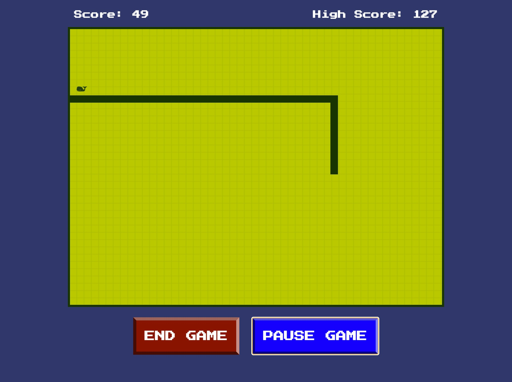

# Retro Snake Game

A Nextjs recreation of the snake game we all played and loved back in the day.

## Authors

- [@khleomix](https://github.com/khleomix)

## Screenshots



## Run Locally

Clone the project

```bash
  git clone git@github.com:khleomix/retro-snake-game.git
```

Go to the project directory

```bash
  cd retro-snake-game
```

Install dependencies

```bash
  npm install --legacy-peer-deps
```

Start the server

```bash
  npm run start
```

Available Scripts

```bash
  npm run dev
  npm run build
  npm run lint
```
